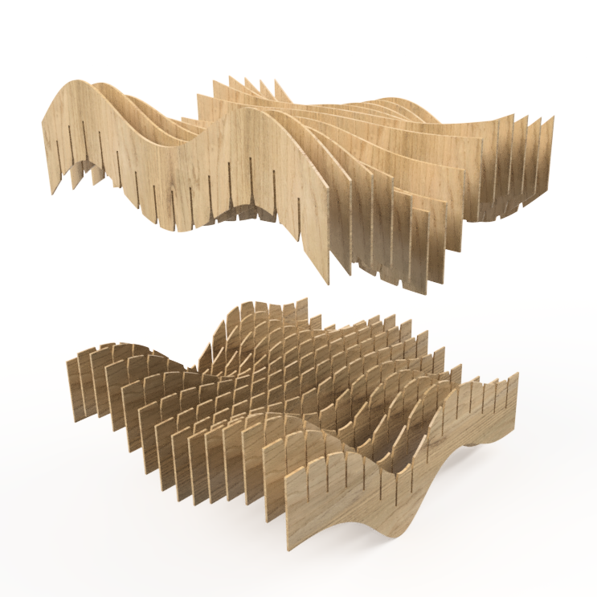
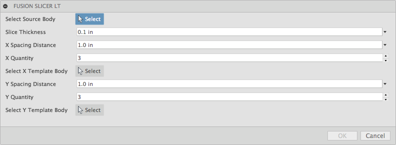
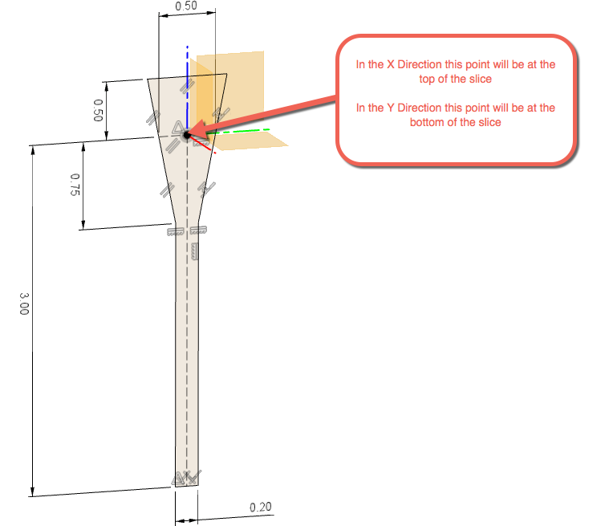
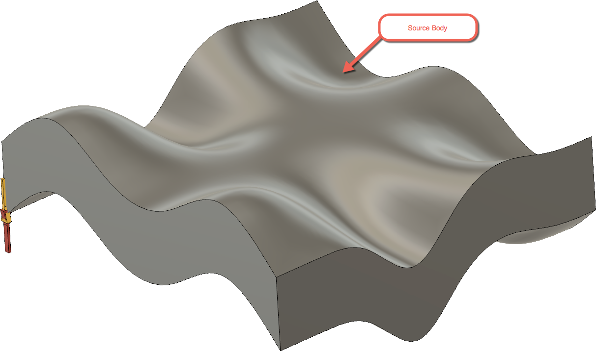
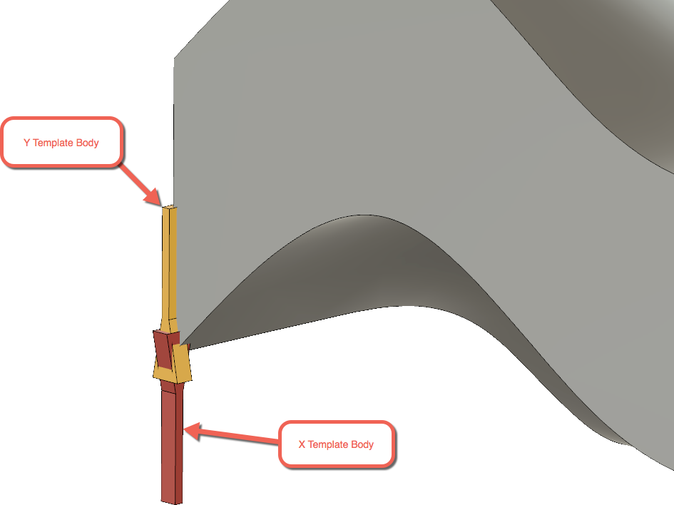

#  EditParam

This is an [Autodesk Fusion 360](http://fusion360.autodesk.com/) script that's used for simply editing user parameters.

This sample is provided "As-is" with no guarantee of performance, reliability or warranty.

# Installation
[Click here to download the Add-in](https://github.com/tapnair/FusionSlicerLT/archive/master.zip)

After downloading the zip file follow the [installation instructions here](https://tapnair.github.io/installation.html) for your particular OS version of Fusion 360

## Usage

1. Enter the Model environment
2. Select Addins/FusionSLicerLT
3. The target body is the body to be split.
4. Set the slice thickness
5. X Template and Y Template bodies are the bodies for use with custom "notching"
   &nbsp;&nbsp;&nbsp; - The origin of the body will define the point on the slice where it is applied.
   &nbsp;&nbsp;&nbsp; - By design the X Template is notched on the top and Y template is notch on the bottom
   &nbsp;&nbsp;&nbsp; - X Template should be sketched on the Y-Z plane
   &nbsp;&nbsp;&nbsp; - Y Template should be oriented on the X-Z Plane

## License
Samples are licensed under the terms of the [MIT License](http://opensource.org/licenses/MIT). Please see the [LICENSE](LICENSE) file for full details.

## Written by

Written by [Patrick Rainsberry](https://twitter.com/prrainsberry)   (Autodesk Fusion 360 Business Development)

See more useful [Fusion 360 Utilities](https://tapnair.github.io/index.html)

